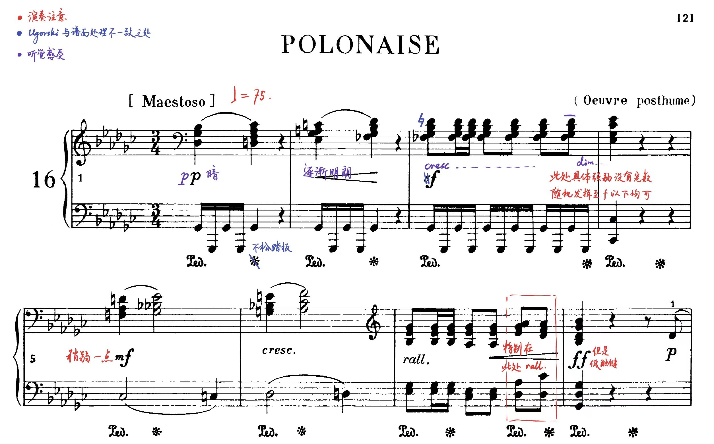

<iframe frameborder="no" border="0" marginwidth="0" marginheight="0" width="100%" height="86" src="//music.163.com/outchain/player?type=2&id=1880745986&auto=0&height=66"></iframe>

有关这首波兰舞曲我们知之甚少. 据 IMSLP 记载, 这首波兰舞曲大约创作于 1829 年. Wikipedia 只用一句话带过: 

> B.36, or Polonaise in G♭ major, was the final polonaise that was published posthumously.

---

## 引子

